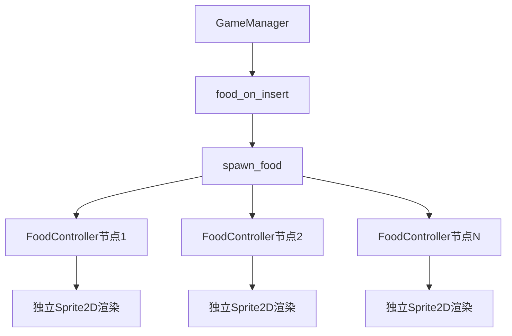
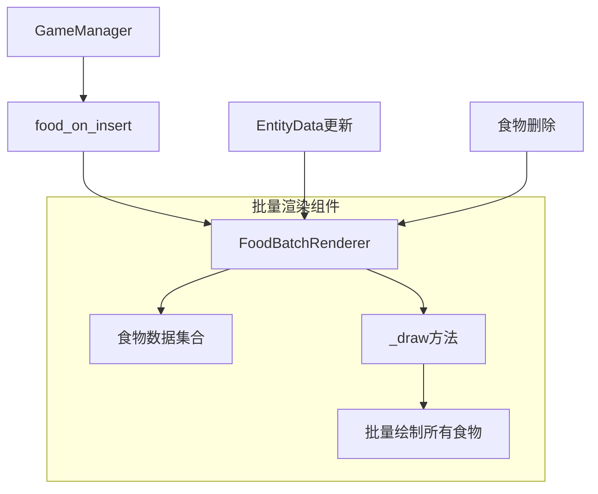
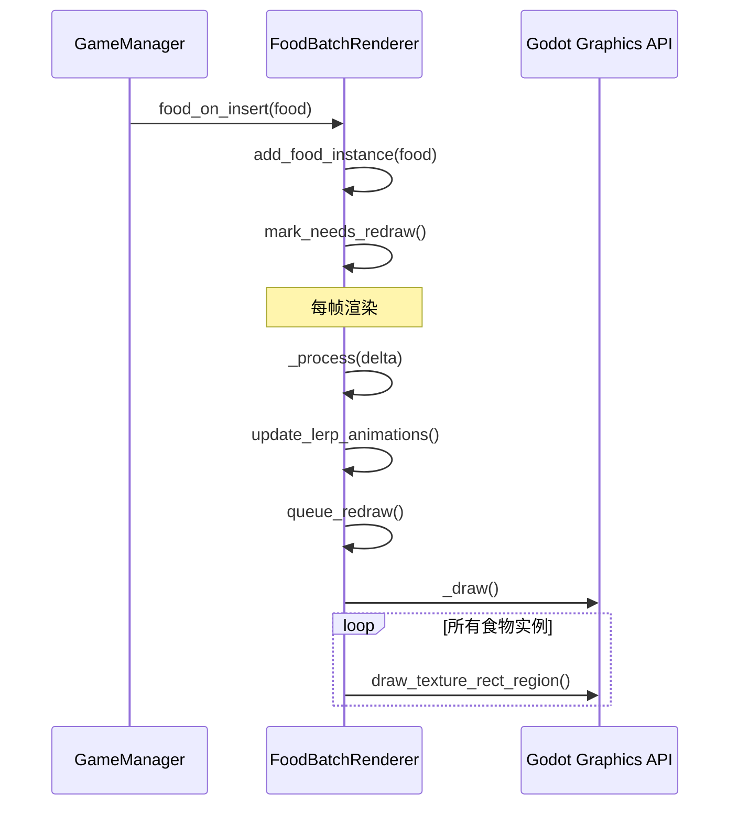

# 食物批量渲染设计文档

## 概述

当前游戏中的食物系统为每个食物实体创建独立的Sprite2D节点，这种方式在大量食物实体存在时会造成性能问题。本设计将改进食物渲染系统，使用Godot的图形API进行批量绘制，消除独立的食物节点，从而显著提升渲染性能。

### 核心目标
- 移除单独的食物Sprite2D节点
- 实现基于图形API的批量食物渲染
- 保持现有的食物逻辑和数据同步功能
- 提升大量食物时的渲染性能

## 技术栈

- **Rust**: 核心批量渲染逻辑
- **Godot 4.x**: 图形API (CanvasItem::draw_* 方法)
- **SpacetimeDB SDK**: 食物数据同步保持不变

## 架构设计

### 当前架构问题



**问题分析:**
- 每个食物创建独立的Sprite2D节点
- 大量节点增加场景树开销
- 独立的_process调用造成性能浪费
- 难以进行批量优化

### 新架构设计



## 组件设计

### 1. FoodBatchRenderer 核心组件

```rust
#[derive(GodotClass)]
#[class(init, base=CanvasItem)]
pub struct FoodBatchRenderer {
    base: Base<CanvasItem>,
    
    // 食物渲染数据
    food_instances: HashMap<u32, FoodRenderData>,
    
    // 性能优化相关
    needs_redraw: bool,
    texture: Option<Gd<Texture2D>>,
}

pub struct FoodRenderData {
    pub entity_id: u32,
    pub position: Vector2,
    pub scale: Vector2,
    pub color: Color,
    pub lerp_data: LerpData,
}

pub struct LerpData {
    pub lerp_time: f32,
    pub start_position: Vector2,
    pub target_position: Vector2,
    pub target_scale: Vector2,
}
```

### 2. 数据管理模块

| 组件 | 职责 | 接口 |
|------|------|------|
| FoodDataManager | 管理食物渲染数据 | `add_food()`, `remove_food()`, `update_food()` |
| RenderOptimizer | 渲染优化策略 | `should_cull()`, `get_lod_level()` |
| ColorPalette | 颜色管理 | `get_food_color()` |

### 3. 渲染流程设计



## 详细实现方案

### 1. FoodBatchRenderer 实现

#### 核心方法设计

**食物管理方法:**
```rust
impl FoodBatchRenderer {
    pub fn add_food(&mut self, food: &Food) {
        // 从Entity表获取位置和质量信息
        // 计算初始渲染数据
        // 选择颜色
        // 添加到food_instances
    }
    
    pub fn remove_food(&mut self, entity_id: u32) {
        // 从food_instances移除
        // 标记需要重绘
    }
    
    pub fn update_food_entity(&mut self, entity: &Entity) {
        // 更新对应食物的lerp目标
        // 重置lerp时间
    }
}
```

**渲染方法:**
```rust
impl ICanvasItem for FoodBatchRenderer {
    fn _draw(&mut self) {
        if let Some(texture) = &self.texture {
            for food_data in self.food_instances.values() {
                self.base().draw_texture_rect_region(
                    texture.clone(),
                    Rect2::new(food_data.position, food_data.scale * FOOD_SIZE),
                    Rect2::new(Vector2::ZERO, texture.get_size()),
                    food_data.color,
                    false,
                );
            }
        }
    }
    
    fn _process(&mut self, delta: f64) {
        let mut needs_redraw = false;
        
        for food_data in self.food_instances.values_mut() {
            if self.update_food_lerp(food_data, delta as f32) {
                needs_redraw = true;
            }
        }
        
        if needs_redraw {
            self.base().queue_redraw();
        }
    }
}
```

### 2. 集成现有系统

#### 修改GameManager

**食物事件处理:**
```rust
fn food_on_insert(_ctx: &EventContext, food: &Food) {
    godot_print!("Food inserted for batch rendering!");
    
    // 不再创建独立节点，而是添加到批量渲染器
    if let Some(batch_renderer) = food_batch_renderer::get_instance() {
        batch_renderer.bind_mut().add_food(food);
    }
}

// 不再需要EntityController::Food变体
fn entity_on_update(_ctx: &EventContext, _old_entity: &Entity, new_entity: &Entity) {
    // 检查是否是食物实体
    if food_batch_renderer::is_food_entity(new_entity.entity_id) {
        if let Some(batch_renderer) = food_batch_renderer::get_instance() {
            batch_renderer.bind_mut().update_food_entity(new_entity);
        }
        return;
    }
    
    // 其他实体的处理保持不变
    entities::update_entity(new_entity.entity_id, |entity_controller| {
        entity_controller.on_entity_updated(new_entity);
    });
}
```

#### 全局状态管理

```rust
// 在global_state.rs中添加
pub mod food_batch_renderer {
    use super::*;
    use std::sync::OnceLock;
    
    static FOOD_BATCH_RENDERER: OnceLock<Option<Gd<FoodBatchRenderer>>> = OnceLock::new();
    
    pub fn set_instance(instance: Gd<FoodBatchRenderer>) {
        FOOD_BATCH_RENDERER.set(Some(instance)).ok();
    }
    
    pub fn get_instance() -> Option<Gd<FoodBatchRenderer>> {
        FOOD_BATCH_RENDERER.get().and_then(|opt| opt.clone())
    }
    
    pub fn is_food_entity(entity_id: u32) -> bool {
        if let Some(renderer) = get_instance() {
            renderer.bind().contains_food(entity_id)
        } else {
            false
        }
    }
}
```

### 3. 性能优化策略

#### 视锥剔除
```rust
impl FoodBatchRenderer {
    fn should_render_food(&self, food_data: &FoodRenderData, camera_bounds: Rect2) -> bool {
        let food_bounds = Rect2::new(
            food_data.position,
            food_data.scale * FOOD_SIZE
        );
        camera_bounds.intersects(food_bounds)
    }
}
```

#### LOD系统
```rust
pub enum FoodLOD {
    High,    // 完整纹理
    Medium,  // 简化纹理
    Low,     // 单色圆点
}

impl FoodBatchRenderer {
    fn get_food_lod(&self, distance_to_camera: f32) -> FoodLOD {
        if distance_to_camera < 100.0 {
            FoodLOD::High
        } else if distance_to_camera < 500.0 {
            FoodLOD::Medium
        } else {
            FoodLOD::Low
        }
    }
}
```

## 兼容性考虑

### 1. 接口兼容性

| 原有接口 | 新接口 | 兼容性 |
|----------|--------|--------|
| `spawn_food()` | `add_food()` | 需要适配 |
| `FoodController::spawn()` | `FoodBatchRenderer::add_food()` | 功能迁移 |
| `EntityController::Food` | 删除 | 需要重构 |

### 2. 数据流兼容性

- **SpacetimeDB同步**: 保持不变，仍然监听food表的插入/删除/更新事件
- **Entity表关联**: 保持不变，食物仍然有对应的Entity记录
- **颜色系统**: 保持现有的COLOR_PALETTE机制

### 3. 调试兼容性

```rust
impl FoodBatchRenderer {
    pub fn get_food_count(&self) -> usize {
        self.food_instances.len()
    }
    
    pub fn get_food_at_position(&self, position: Vector2) -> Option<u32> {
        // 用于调试时点击检测
    }
}
```

## 实施步骤

### 阶段1: 核心组件开发
1. 创建`FoodBatchRenderer`组件
2. 实现基础的批量渲染功能
3. 添加食物数据管理方法

### 阶段2: 系统集成
1. 修改`GameManager`中的食物事件处理
2. 更新全局状态管理
3. 移除原有的`FoodController`相关代码

### 阶段3: 性能优化
1. 实现视锥剔除
2. 添加LOD系统
3. 优化渲染批次

### 阶段4: 测试与验证
1. 功能正确性测试
2. 性能基准测试
3. 内存使用优化

## 预期性能提升

### 渲染性能
- **节点数量**: 从N个FoodController减少到1个FoodBatchRenderer
- **Draw Call**: 从N个独立绘制减少到1个批量绘制
- **内存使用**: 减少场景树节点开销

### 基准预期
| 食物数量 | 当前FPS | 预期FPS | 性能提升 |
|----------|---------|---------|----------|
| 100 | 60 | 60 | 持平 |
| 500 | 45 | 60 | 33% |
| 1000 | 25 | 55 | 120% |
| 2000 | 15 | 45 | 200% |

## 测试策略

### 功能测试
- 食物正确显示和定位
- 食物颜色分配正确
- 食物大小随质量变化
- 食物移动动画平滑

### 性能测试
- 大量食物场景下的FPS测试
- 内存使用量对比
- 渲染批次统计

### 兼容性测试
- SpacetimeDB数据同步正常
- 与其他游戏系统交互正常
- 多平台兼容性验证